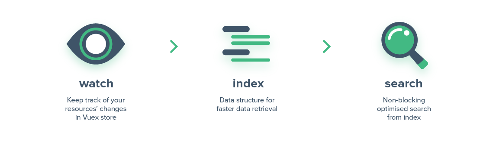

<p align="center"><a href="https://albertlucianto.github.io/vuex-search" target="_blank" rel="noopener noreferrer"></a></p>

<p align="center">
<a href="https://codecov.io/github/AlbertLucianto/vuex-search?branch=master"></a>
<a href="https://travis-ci.org/AlbertLucianto/vuex-search"></a>
<a href="https://npmcharts.com/compare/vuex-search?minimal=true"></a>
<a href="https://npmcharts.com/compare/vuex-search?minimal=true"></a>
<a href="https://www.npmjs.com/package/vuex-search"></a>
<a href="https://www.npmjs.com/package/vuex-search"></a>
</p>

> Vuex Search is a plugin for searching collections of objects. Search algorithms powered by [js-worker-search](https://github.com/bvaughn/js-worker-search).

<p align="center"></p>

## See working example [here](https://albertlucianto.github.io/vuex-search).

## Installation:

```bash
npm install --save vuex-search
# or
yarn add vuex-search
```

## Overview

vuex-search searches collections of documents and returns results as an `Array` of document ids. It is important to note that the documents themselves aren't returned. This is because the actual search is performed in a web-worker thread for performance reasons. In order to avoid serializing the documents and passing them back and forth, vuex-search simply passes their ids.

Because of this, __each document must contain an `id` attribute.__

## Examples

```javascript
// store/state.js

export default {
  myResources: {
    contacts: [
      {
        // id is required for each record
        id: '1',
        address: '06176 Georgiana Points',
        name: 'Dr. Katrina Stehr',
      },
      {
        id: '2',
        address: '06176 Georgiana Points',
        name: 'Edyth Grimes',
      },
    ],
  },
}
```

### Vuex Search plugin

#### `searchPlugin(options)`

* __`options`__: List of options for defining the plugin. Available options are:

  * __`resources:`__ `{ [resourceName]: IndexOptions }`

    Dictionary of `resourceName` and their index options. [See `IndexOptions`.](#indexoptions)

  * __`[searchApi]:`__ `SearchApi`

    If provided, it will be used as default searchApi across resources. [See customizing search index.](#customizing-search-index) Default: `new SearchApi()`

```javascript
// store/index.js
import Vue from 'vue';
import Vuex from 'vuex';
import searchPlugin from 'vuex-search';
import state from './state';

Vue.use(Vuex);

const store = new Vuex.Store({
  state,
  plugins: [
    searchPlugin({
      resources: {
        contacts: {
          // what fields to index
          index: ['address', 'name'],
          // access the state to be watched by Vuex Search
          getter: state => state.myResources.contacts,
        },
        // otherResource: { index, getter, watch, searchApi },
      },
    }),
  ],
});
```

#### `IndexOptions`

* __`index:`__ `Array<String>`

  List of fields to be indexed.

* __`getter:`__ `(state) => Array|Object`

  Getter function to access the resource from root state and to watch.

* __`[watch]:`__ `Boolean`

  Whether needs to reindex if resource changes. This option is useful to avoid reindex overhead when the resource frequently changes. Reindexing can be done by [mapping action `reindex`.](#mapactions(resourcename,-actionmap)) Default: `true`

* __`[searchApi]:`__ `SearchApi`

  [Custom search index.](#customizing-search-index) If defined, it is used instead of the shared `searchApi` instance.

### Binding with Vue Component

```javascript
import {
  mapActions as mapSearchActions,
  mapGetters as mapSearchGetters,
  getterTypes,
  actionTypes,
} from 'vuex-search';
```

```javascript
// SomeComponent.vue

data() {
  return { text: '' },
},

computed: {
  ...mapSearchGetters('contacts', {
    resultIds: getterTypes.result,
    isLoading: getterTypes.isSearching,
  }),
},

methods: {
  ...mapSearchActions('contacts', {
    searchContacts: actionTypes.search,
  }),
  doSearch() {
    this.searchContacts(this.text);
  },
},
```

#### `mapGetters(resourceName, getterMap)`

Similar to Vuex helper for mapping attributes, `getterMap` can be either an object or an array.

#### `mapActions(resourceName, actionMap)`

Similar to Vuex helper for mapping attributes, `actionMap` can be either an object or an array.

#### `getterTypes`

* __`result`__

  Mapped state is an array of ids.

* __`isSearching`__

  Mapped state indicates whether `searchApi` has resolved its promise of search result.

* __`resourceIndex`__

  Full state of resource index: `result`, `isSearching`, and current search `text`.

#### `actionTypes`

* __`search`__

  Mapped action's function signature: `(query: String) => void`.

* __`reindex`__

  Mapped action's function signature: `() => void`. To be used when option `watch` is `false`. This action will reindex the resource and automatically re-search current text.

* __`registerResource`__

  Mapped action's function signature: `(options: IndexOptions) => void`. This action will dynamically add `resourceName` with options provided. [See `IndexOptions`.](#indexoptions)

  [More about Dynamic Index Registration.](#dynamic-index-registration)

* __`unregisterResource`__

  Mapped action's function signature: `() => void`. This action will unwatch and remove `resourceName` index.

### Customizing Search Index

By default, vuex-search builds an index to match all substrings.
You can override this behavior by providing your own, pre-configured `searchApi` param to the plugin like so:

```js
import searchPlugin, { SearchApi, INDEX_MODES } from 'vuex-search';

// all-substrings match by default; same as current
// eg 'c', 'ca', 'a', 'at', 'cat' match 'cat'
const allSubstringsSearchApi = new SearchApi();

// prefix matching (eg 'c', 'ca', 'cat' match 'cat')
const prefixSearchApi = new SearchApi({
  indexMode: INDEX_MODES.PREFIXES,
});

// exact words matching (eg only 'cat' matches 'cat')
const exactWordsSearchApi = new SearchApi({
  indexMode: INDEX_MODES.EXACT_WORDS,
});

const store = new Vuex.Store({
  state,
  plugins: [
    searchPlugin({
      resources: {
        contacts: {
          index: ['address', 'name'],
          getter: state => state.myResources.contacts,
        },
      },
      searchApi: exactWordsSearchApi, // or allSubstringSearchApi; or prefixSearchApi
    }),
  ],
});
```

### Custom word boundaries (tokenization) and case-sensitivity

You can also pass parameters to the SearchApi constructor that customize the way the
search splits up the text into words (tokenizes) and change the search from the default
case-insensitive to case-sensitive:

```js
import searchPlugin, { SearchApi } from 'vuex-search';

const store = new Vuex.Store({
  state,
  plugins: [
    searchPlugin({
      resources: {
        contacts: {
          index: ['address', 'name'],
          getter: state => state.myResources.contacts,
        },
      },
      searchApi: new SearchApi({
        // split on all non-alphanumeric characters,
        // so this/that gets split to ['this','that'], for example
        tokenizePattern: /[^a-z0-9]+/,
        // make the search case-sensitive
        caseSensitive: true,
      }),
    }),
  ],
});
```

### Dynamic Index Registration

When a module needs to be loaded or registered dynamically, statically defined plugin can be a problem. The solution is to use vuex-search dynamic index registration.

`VuexSearch` instance can be accessed through `search` attribute of `store`. Thus, in a Vue instance it is accessed through `this.$store.search`. Available methods are:

#### `registerResource(resourceName, options: IndexOptions)`

* __`options:`__ `IndexOptions`

  A list of options for indexing resource. [See `IndexOptions`.](#indexoptions)

_Note that this method is slightly different from `registerResource` from `mapActions`. Calling this method needs to provide `resourceName`. Whereas, method from `mapActions` has already injected `resourceName` as its first argument._


#### `unregisterResource(resourceName)`

Remove outdated resource indexes, and unwatch/unsubscribe any watchers/subscriptions related to `resourceName`.

### Changing Base

By default, vuex-search will register its module in `'vuexSearch/'` from root state. To avoid possible clash naming, you can change its base name before defining the plugin in the store through

```js
import { VuexSearch } from 'vuex-search';

VuexSearch.base = 'vuexSearchNew';

const store = new Vuex.Store({
  // ... store options
});
```

Changelog
---------

Changes are tracked in the [changelog](CHANGELOG.md).

License
---------

vuex-search is available under the MIT License.